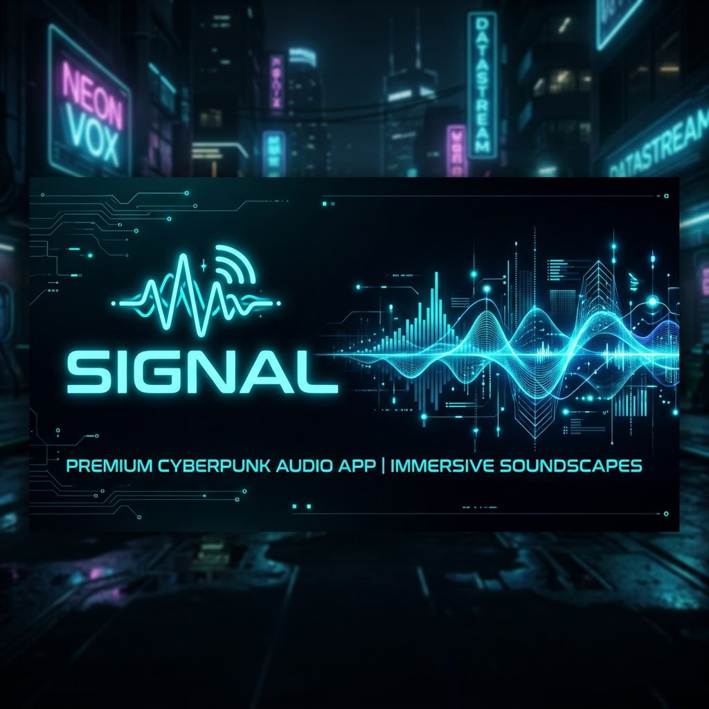
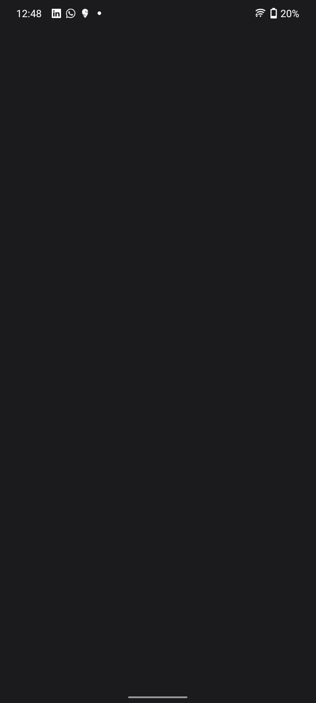
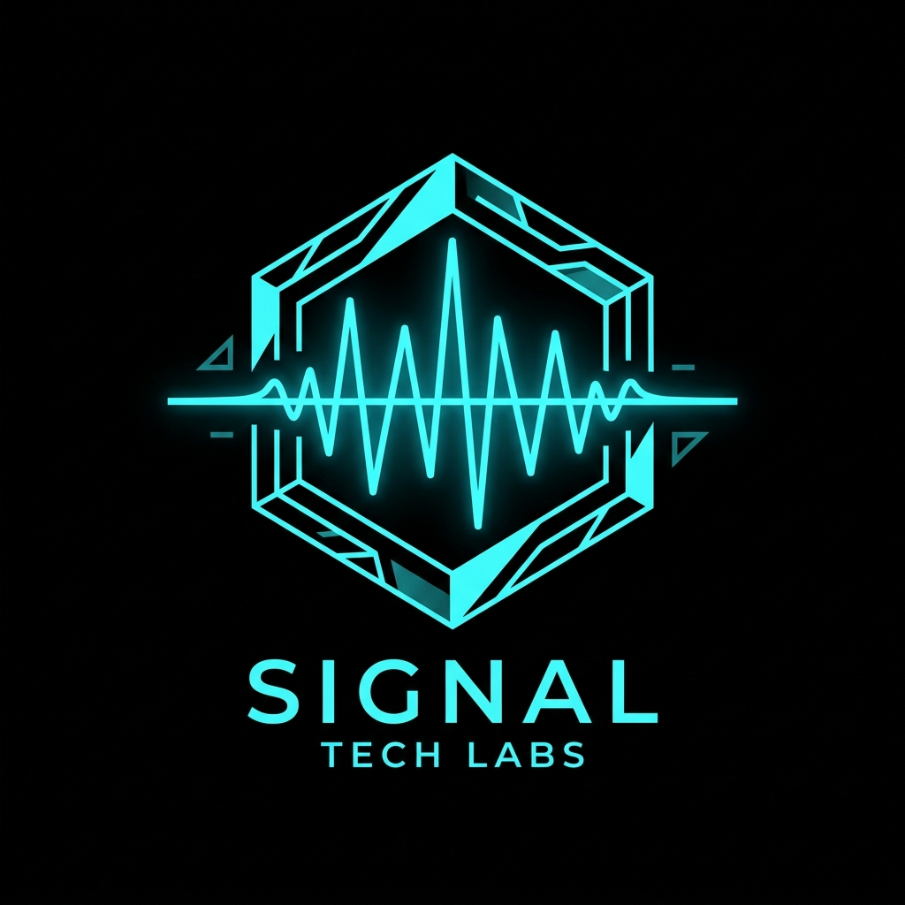
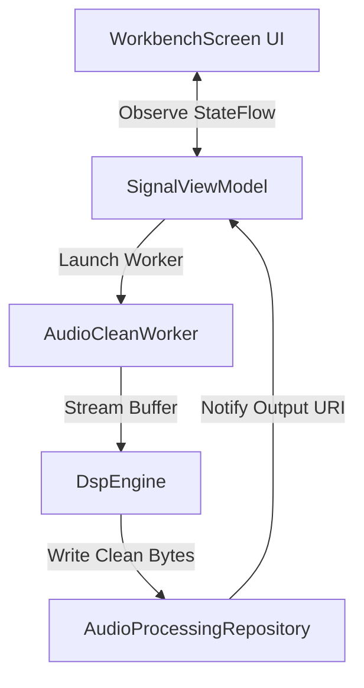
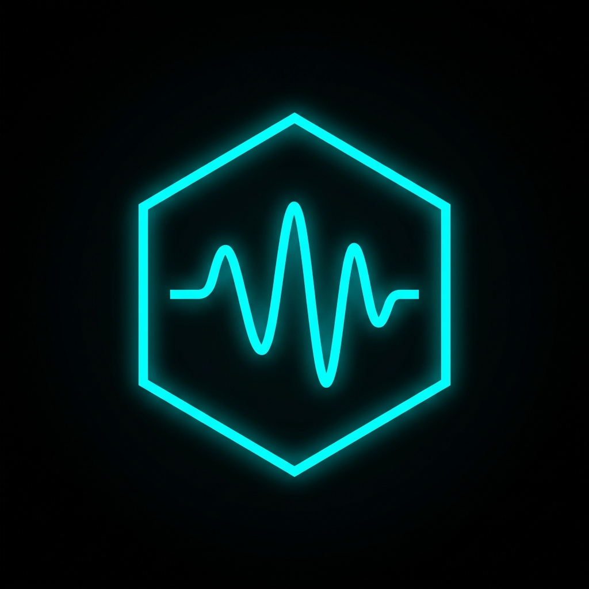

<div align="center">
  

  <br />

  <h1>⚡ SIGNAL</h1>
  <h3>Premium Cyberpunk DSP Voice-Cleaning & Audio Processing Engine</h3>

  <p>
    <a href="https://github.com/TheRealSaiTama/Signal/releases/latest">
      
    </a>
    
    
    
  </p>

  <p><strong>A state-of-the-art Android audio-restoration workbench built with Kotlin, Jetpack Compose, and advanced digital signal processing (DSP).</strong></p>
</div>

---

## 🔮 Overview

**Signal** is a futuristic, industrial-themed audio processing dashboard designed to clean, restore, and optimize audio recordings directly on your device. Powered by state-driven processing queues and a custom DSP engine, Signal transforms noisy environments into crystal-clear vocal tracks with high-fidelity outputs.

---

## 🌟 Key Features

* **⚡ Cyberpunk Glassmorphic Dashboard**: A stunning dark user interface featuring custom-rendered glowing borders circulating around interactive console blocks.
* **🎙️ Deep-Voice Cleaning (DSP)**: Advanced background noise cancellation and signal stabilization powered by local DSP algorithms and DeepFilterNet integration.
* **🎚️ State-Driven Lifecycle**: Visualized pipeline transition states:
  $$\text{Idle} \longrightarrow \text{Source Loaded} \longrightarrow \text{DSP Processing} \longrightarrow \text{Completed}$$
* **📊 Live Waveform Metrics**: Interactive wave views showing input signals versus cleaned output streams.
* **💾 High-Fidelity Export**: Native Android file I/O exporting to premium `.m4a` and `.wav` formats with zero compression loss.

---

## 📸 Interface Showcase

<div align="center">
  <table border="0">
    <tr>
      <td align="center" width="50%">
        <strong>📱 Android Workbench UI</strong><br/>
        
      </td>
      <td align="center" width="50%">
        <strong>🧬 Waveform Wave Logo</strong><br/>
        
      </td>
    </tr>
  </table>
</div>

---

## ⚙️ Technical Architecture

The app follows a modern Android architecture pattern separating visual render loops, reactive states, and heavy background DSP threads:



* **UI Layer (`WorkbenchScreen.kt`)**: Implemented completely in Jetpack Compose, using custom modifiers like `.circulatingBorder()` powered by `PathMeasure` for glowing UI cards.
* **State Manager (`MainViewModel.kt`)**: Exposes a unified `StateFlow<WorkbenchState>` containing states: `Idle`, `SourceLoaded`, `Processing`, `Completed`, and `Error`.
* **Processing Pipeline (`AudioCleanWorker.kt` & `DspEngine.kt`)**: Runs heavy audio computations safely in the background using Android WorkManager, ensuring the UI thread remains completely responsive.

<div align="center">
  
</div>

---

## 🚀 Quick Start & Installation

### 📥 1. Direct Install
Skip the build process and download the pre-compiled installer directly to your Android device:
1. Go to the [Latest Releases](https://github.com/TheRealSaiTama/Signal/releases/latest) section.
2. Download the `app-debug.apk` file.
3. Open the file on your Android device and authorize **Install from Unknown Sources** when prompted.

### 💻 2. Build from Source
If you are a developer and want to run it via Android Studio:
1. Clone this repository:
   ```bash
   git clone https://github.com/TheRealSaiTama/Signal.git
   ```
2. Open the project in **Android Studio (Koala or newer)**.
3. Create a file named `.env` in the root folder and add your Google AI Studio key:
   ```env
   GEMINI_API_KEY=your_api_key_here
   ```
4. Remove this signing config validation check from `app/build.gradle.kts` if you are signing it locally:
   ```kotlin
   signingConfig = signingConfigs.getByName("debugConfig")
   ```
5. Click **Run** to launch the application on your physical device or emulator.

---

## 🧠 Obsidian AI Brain Integration

All design, architectural layout, and build notes are mapped in Markdown files for easy integration with your local knowledge vault:
* [`documents/Overview.md`](file:///home/therealsaitama/signal/documents/Overview.md) — High-level summary.
* [`documents/Architecture.md`](file:///home/therealsaitama/signal/documents/Architecture.md) — Tech stack and lifecycle specifications.
* [`obsidian_ai_brain/Overview.md`](file:///home/therealsaitama/signal/obsidian_ai_brain/Overview.md) — Obsidian-optimized index file.

---

<div align="center">
  <p>Created with 🩵 by <a href="https://github.com/TheRealSaiTama">TheRealSaiTama</a></p>
</div>
