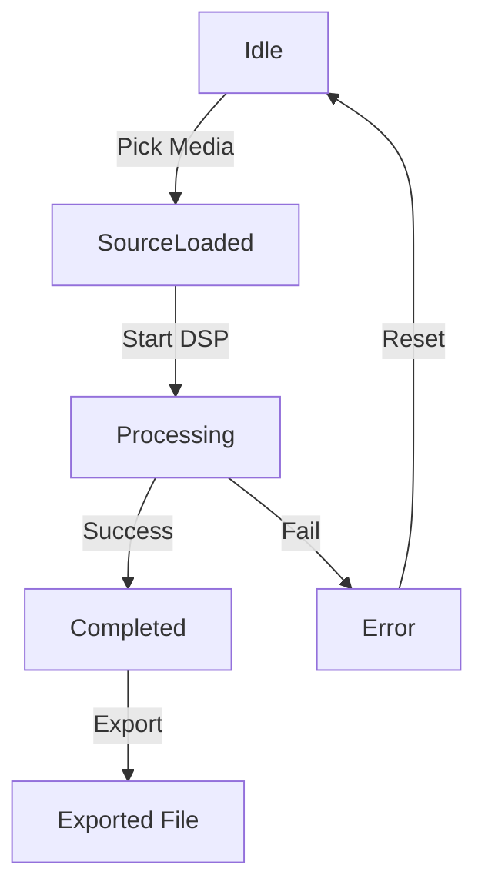

# Signal App Architecture

## High‑Level Components
- **UI Layer** – Jetpack Compose UI in `WorkbenchScreen.kt` and related composables. Handles visual state, animations, and user interactions.
- **ViewModel Layer** – `SignalViewModel.kt` (not shown here) exposing a `StateFlow<WorkbenchState>` to the UI. Contains business logic for media picking, DSP processing, and exporting.
- **Audio Engine** – Kotlin‑based DSP pipeline (e.g., using FFmpeg/LibSox). Abstracted behind `AudioProcessor` interfaces inside the `domain` package.
- **Repository/Service Layer** – Handles file I/O, media storage, and permission checks. Uses Android `ContentResolver` to access media files.
- **Dependency Injection** – Simple manual DI via constructor injection in `SignalViewModel` (could be replaced with Hilt later).

## State Machine (`WorkbenchState`)
```kotlin
sealed class WorkbenchState {
    object Idle : WorkbenchState()
    object SourceLoaded : WorkbenchState()
    object Processing : WorkbenchState()
    object Completed : WorkbenchState()
    data class Error(val message: String) : WorkbenchState()
}
```
State changes trigger UI recomposition and animation updates.

## Flow Diagram (Mermaid)


---
*All components are kept modular for future extension (e.g., adding a library‑based AI filter).*
